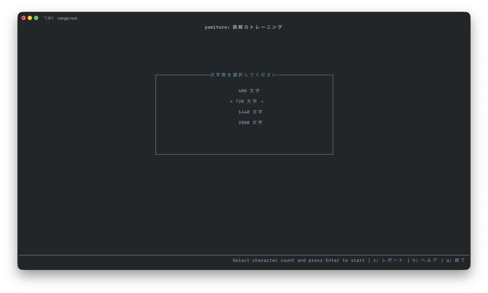
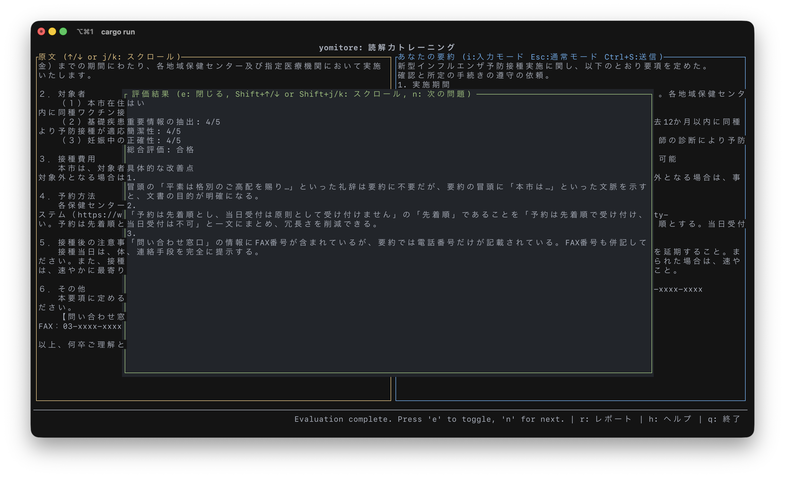
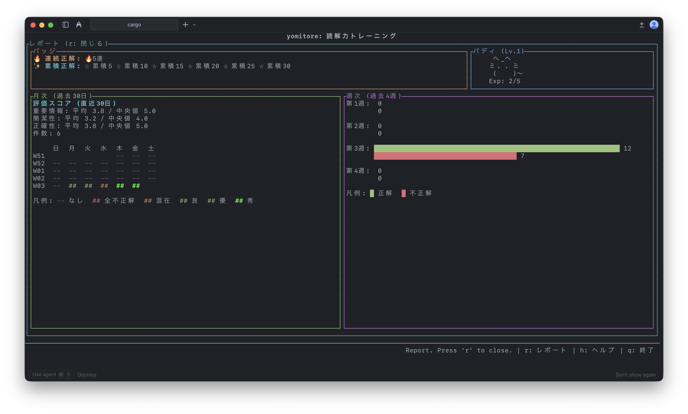

# yomitore (読トレ)

`yomitore` は、AI との対話的なトレーニングを通じて、ユーザーの読解力と要約力を向上させるために設計された TUI アプリケーションです。

## 概要

このツールは Rust で開発されており、GroqCloud API を活用して、読解と要約の演習を継続的に提供します。主要なデスクトップオペレーティングシステム (Windows, macOS, Linux) でシームレスに動作するターミナルベースのアプリケーションです。







## 特徴

1. **AI による文章生成**: アプリケーションは、AI に対してフォーマルな文章を要求します。文章の長さはユーザが、400 字、720 字、1440 字、2880 字から選択できます。
2. **対話的な要約**: ユーザーは、提供された文章の要約を入力するよう求められます。複数行の入力もサポートされています。
3. **AI による評価**: ユーザーの要約は、元の文章との比較評価のために AI に送信されます。悪かった点を具体的に教えてくれます。
4. **継続的なループ**: フィードバックを受けた後、ユーザーは次の問題に進むことができ、継続的な練習が可能です。
5. **グラフ:** 月次、週次の正誤履歴を、ヒートマップや棒グラフで確認できます。
6. **レイアウト:** 2 分割のブロックに、AI による診断結果を表示するフローティングブロックで見やすく利用可能。(100x30 のターミナルサイズが必要です)

## 要件

- [Rust](https://www.rust-lang.org/tools/install)（`cargo` を含む）

## セットアップ

### API キーの設定

このアプリケーションを使用するには、[GroqCloud](https://console.groq.com/keys) の有効な API キーが必要です。アプリケーションは、以下の 2 つの方法のいずれかで設定できます。

1. **環境変数（推奨）**:
   `GROQ_API_KEY` 環境変数を設定します。

   ```sh
   export GROQ_API_KEY="your_api_key_here"
   ```

2. **設定ファイル**:
   以下のパスに設定ファイル `config.toml` を手動で作成し、API キーを設定します。

   **ファイルパス:**
   - **Linux:** `~/.config/yomitore/config.toml`
   - **macOS:** `~/Library/Application Support/yomitore/config.toml`
   - **Windows:** `C:\Users\<user>\AppData\Roaming\yomitore\config\config.toml`

   **内容:**

   ```toml
   api_key = "your_api_key_here"
   ```

   ※ アプリケーション起動時に、このファイルに有効なキーが保存されている場合は、自動的に読み込まれます。

## 実行方法

1. リポジトリをクローンします(まだの場合)：

   ```sh
   # git clone <repository_url>
   # cd yomitore
   ```

2. `cargo` を使用してアプリケーションを実行します：

   ```sh
   # cargo run
   ```

3. リリースバイナリをビルドするには：

   ```sh
   # cargo build --release
   ```

   実行ファイルは `target/release/yomitore` に配置されます。
