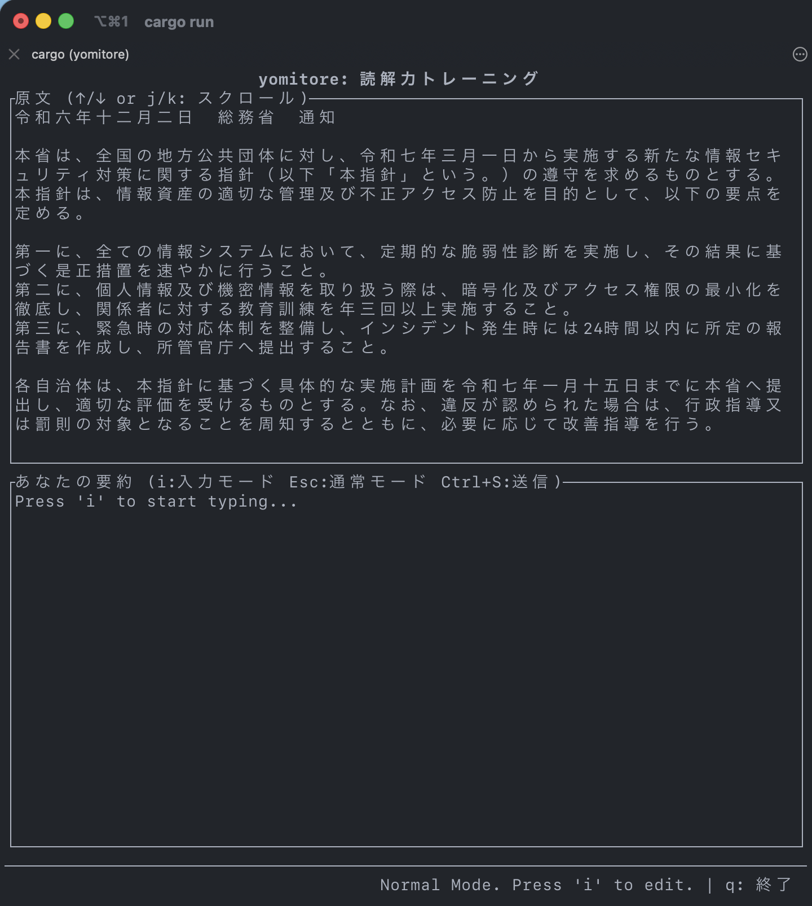
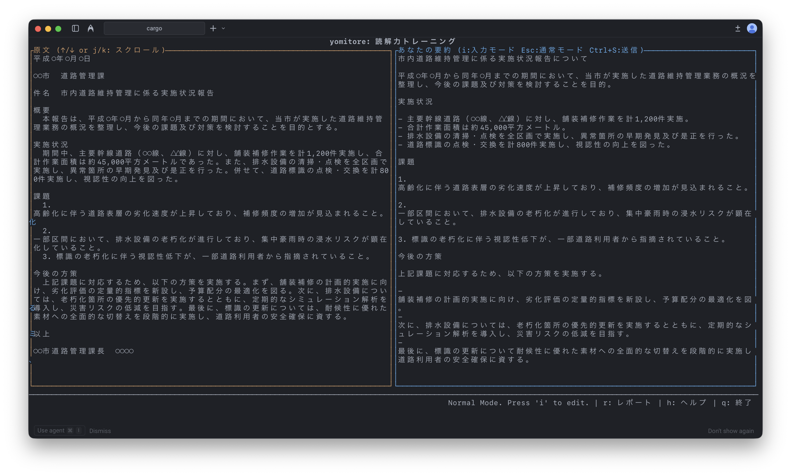

# yomitore (読トレ)

`yomitore` は、AI との対話的なトレーニングを通じて、ユーザーの読解力と要約力を向上させるために設計された CLI ベースのアプリケーションです。

## 概要

このツールは Rust で開発されており、CloudGroq API を活用して、読解と要約の演習を継続的に提供します。主要なデスクトップオペレーティングシステム (Windows, macOS, Linux) でシームレスに動作するターミナルベースのアプリケーションです。




## 特徴

1.  **AI による文章生成**: アプリケーションは、AI に対して 400 文字のフォーマルな文章を要求します。
2.  **対話的な要約**: ユーザーは、提供された文章の要約を入力するよう求められます。複数行の入力もサポートされています。
3.  **AI による評価**: ユーザーの要約は、元の文章との比較評価のために AI に送信されます。
4.  **継続的なループ**: フィードバックを受けた後、ユーザーは次の問題に進むことができ、継続的な練習が可能です。

## 要件

- [Rust](https://www.rust-lang.org/tools/install)（`cargo` を含む）

## セットアップ

### API キーの設定

このアプリケーションを使用するには、[CloudGroq](https://console.groq.com/keys) の有効な API キーが必要です。アプリケーションは、以下の 3 つの方法のいずれかで設定できます。

1.  **環境変数（推奨）**:
    `GROQ_API_KEY`環境変数を設定します。

    ```sh
    export GROQ_API_KEY="your_api_key_here"
    ```

2.  **.env ファイル**:
    プロジェクトのルートディレクトリ（`yomitore/`）に`.env`という名前のファイルを作成し、以下の行を追加します。

    ```
    GROQ_API_KEY="your_api_key_here"
    ```

    設定ファイルの場所：

    - **Linux:** `~/.config/yomitore/config.toml`
    - **macOS:** `~/Library/Application Support/yomitore/config.toml`
    - **Windows:** `C:\Users\<user>\AppData\Roaming\yomitore\config\config.toml`

3.  **実行時のプロンプト**:
    上記のいずれの方法も使用されていない場合、アプリケーションは起動時に API キーを安全に入力するよう求めます。

## 実行方法

1.  リポジトリをクローンします(まだの場合)：

    ```sh
    # git clone <repository_url>
    # cd yomitore
    ```

2.  `cargo` を使用してアプリケーションを実行します：

    ```sh
    # cargo run
    ```

3.  リリースバイナリをビルドするには：
    ```sh
    # cargo build --release
    ```
    実行ファイルは `target/release/yomitore` に配置されます。
