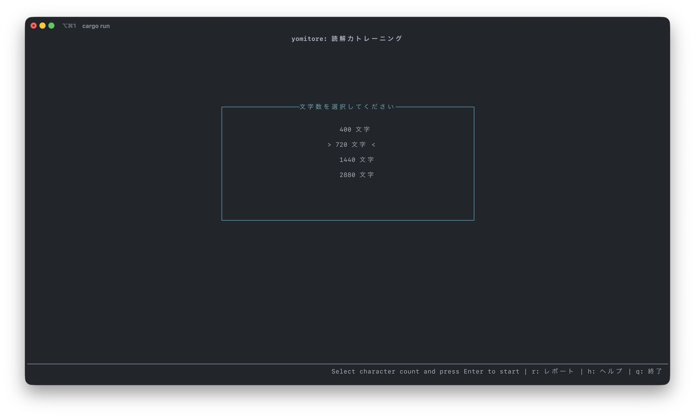
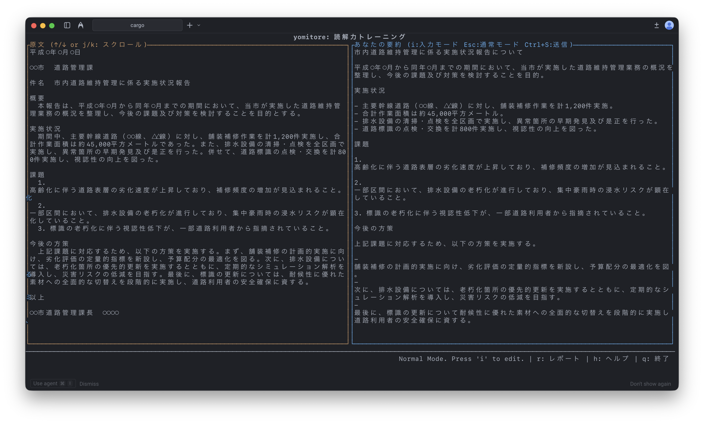
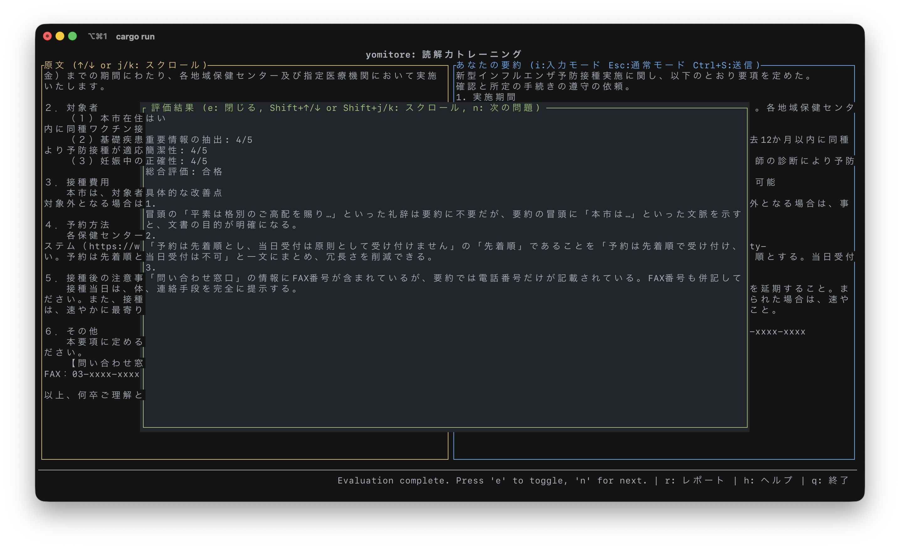
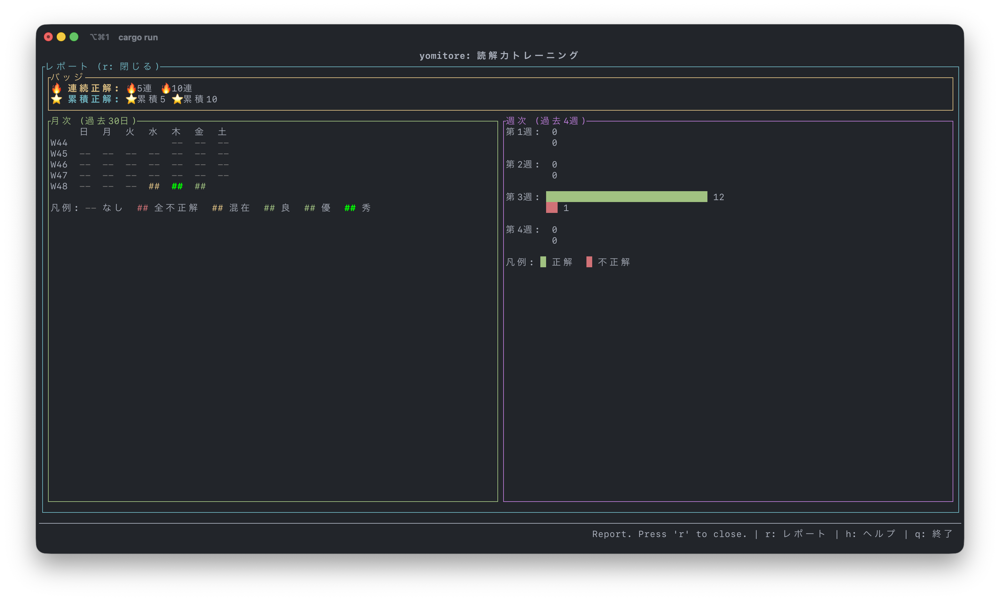

# yomitore (読トレ)

`yomitore` は、AI との対話的なトレーニングを通じて、ユーザーの読解力と要約力を向上させるために設計された TUI アプリケーションです。

## 概要

このツールは Rust で開発されており、GroqCloud API で文章と改善点を生成し、TypeSafe AI の Jev で要約を判定します。主要なデスクトップオペレーティングシステム (Windows, macOS, Linux) で動作するターミナルベースのアプリケーションです。






## 特徴

1. **AI による文章生成**: アプリケーションは、AI に対してフォーマルな文章を要求します。文章の長さは以下から選択可能です。
   - 400 字: 簡単な文章 (原稿用紙一枚)
   - 720 字: 中程度の文章 (A4 用紙半分)
   - 1440 字: 複雑な文章 (A4 用紙一枚)
   - 2880 字: 長い文章 (A4 用紙二枚)
2. **対話的な要約**: ユーザーは、提供された文章の要約を入力するよう求められます。複数行の入力もサポートされています。
3. **AI による評価**: Jev が要約の適切さ、重要情報、簡潔性、正確性、合否を判定し、Groq が改善点を3件示します。3つの評価から0〜100点の総合得点も表示します。
4. **継続的なループ**: フィードバックを受けた後、ユーザーは次の問題に進むことができ、継続的な練習が可能です。
5. **グラフ**: 直近180日と週次の正誤履歴を、週横軸・曜日縦軸のヒートマップや棒グラフで確認できます。
6. **スコア**: 直近180日の「重要情報」「簡潔性」「正確性」の平均値と中央値を保存・表示できます。
7. **レイアウト**: 2 分割のブロックに、AI による診断結果を表示するフローティングブロックで見やすく利用可能 (100x30 のターミナルサイズが必要です)。
8. **アワード**: 連続正解数 (ストリーク) や累積正解数に応じて、アワードが授与されます。
9. **バディ**: 以下のキャラクターを育成することができます。育成には、正解数に応じて得られるポイントを使用します。なお、バディは2コマアニメーションします。

   ```text
   レベル 1    →    レベル 2    →    レベル 3
     ╱|、            ヘ_ヘ           ヘ_ヘ
   (˚ˎ。7           ミ. . ミ        ミ. . ミ
    |、˜〵〜          |、 〵〜        (    )〜
   ```

## 要件

- [Rust](https://www.rust-lang.org/tools/install) (`cargo` を含む)

## セットアップ

### API キーの設定

文章生成には [GroqCloud](https://console.groq.com/keys) の API キー、要約評価には [TypeSafe AI](https://docs.typesafe.ai/introduction) の Jev API キーが必要です。起動後にメニュー、またはトレーニング画面の `s` で設定画面を開き、両方のキーを保存できます。保存済みキーの値は画面に再表示されません。

Groq キーは以下の方法でも設定できます。環境変数が設定ファイルより優先されます。Jev キーは設定画面または設定ファイルで設定します。

1. **環境変数 (推奨)**:
   `GROQ_API_KEY` 環境変数を設定します。

   ```sh
   export GROQ_API_KEY="your_api_key_here"
   ```

2. **設定ファイル**:
   以下のパスに設定ファイル `config.toml` を手動で作成し、API キーを設定します。

   **ファイルパス**:
   - **Linux**: `~/.config/yomitore/config.toml`
   - **macOS**: `~/Library/Application Support/yomitore/config.toml`
   - **Windows**: `%APPDATA%\yomitore\config.toml`

   **内容**:

   ```toml
   api_key = "your_api_key_here"
   jev_api_key = "your_jev_api_key_here"
   ```

   ※ アプリケーション起動時に、このファイルに有効なキーが保存されている場合は、自動的に読み込まれます。

## 実行方法

1. リポジトリをクローンします (まだの場合)：

   ```sh
   git clone https://github.com/tkumata/yomitore.git
   cd yomitore
   ```

2. `cargo` を使用してアプリケーションを実行します：

   ```sh
   cargo run
   ```

3. リリースバイナリをビルドするには：

   ```sh
   cargo build --release
   ```

   実行ファイルは `target/release/yomitore` に配置されます。

## 操作方法

[HELP](./docs/HELP.md) を参照してください。
