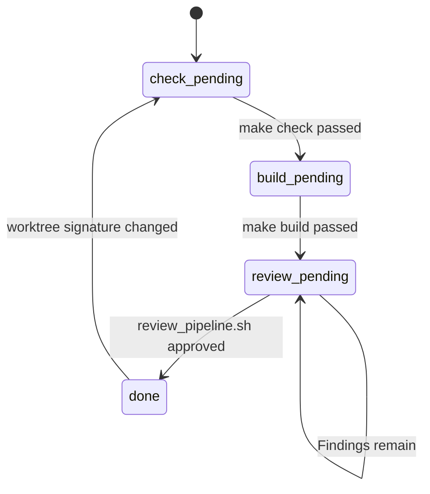

# DESIGN

## 起動時メニューの中央寄せ

- 起動直後の文字数選択メニューは、選択状態によって文字列幅が変わらないようにする
- 選択状態は文字列の増減ではなくスタイルで表現し、メニュー全体が中央に見えることを優先する
- 起動直後の縦配置は、最上部の 1 行余白、タイトルロゴ、1 行余白、アプリ名、3 行余白、文字数選択ブロックの順に固定する
- 文字数選択ブロック内は選択肢を 1 行ずつ並べ、項目間に空行を入れない

## 評価結果ダイアログ余白追加

- 画面全体に対して上下左右2セルの余白を確保するため、全体領域から内側に縮めた利用可能領域を導入する
- ダイアログのサイズと位置は利用可能領域を基準に計算する
- 最小サイズ定数は維持しつつ、利用可能領域を超える場合は利用可能領域に合わせて縮める
- 既存の評価結果ダイアログのみを対象とし、他の画面やオーバーレイは変更しない

## バディ機能

- `TrainingStats` 構造体に `Buddy` 構造体を追加し、レベルと経験値を管理する
- トレーニング合格時に経験値を加算し、閾値（5回）を超えたらレベルアップさせる
- 統計データ読み込み時（アプリ起動時等）に、最終トレーニング日時と現在日時を比較し、3日以上経過していればレベルダウンさせる
- レポート画面(`reports.rs`)の右側にバディの ASCII アートを表示する
- ASCII アートはレベルごとに変化させる（例: 卵 -> 幼体 -> 成体）

## テスト導入

- `ApiClient` の実装をトレイトで抽象化し、本番実装とテスト実装を差し替え可能にする
- テスト実装は固定の評価結果文字列を返す（合格/不合格/壊れた形式）
- 評価結果のパースと合否判定は純粋関数として分離し、ユニットテストで検証する
- テストはモジュール名ベースで絞り込み実行できる構成にする
- 評価結果パースは8行必須・順序自由で解釈し、数値は 1〜5 のみ許可、壊れた形式は Err とする
- 評価結果の表示は固定順とし、数値は 1〜5 をそのまま表示する
- パース失敗時は評価結果オーバーレイにエラーメッセージを表示する
- 評価結果の余分な行は無視し、先頭の箇条書き記号が異なっていても解釈する

## AI エージェントハーネスのレビューゲート

- `check` と `build` は通過条件であり、完了条件ではない
- `build` 成功後は `review_pending` に遷移し、`review_pipeline.sh` を手動実行して完了可否を確定する
- `review_pending` の間は `Stop` / `agentStop` を完了扱いにせず、レビュー要求として継続応答する
- レビューで指摘が残る場合は `review_pending` に留め、修正後に再レビューする
- `review_pipeline.sh` 承認時に作業ツリーのスナップショットを保存し、`done` の後にその差分が変わった場合だけ次の `Stop` で `check_pending` に戻して再点火する

## レポートヒートマップ改善

- 月次レポートのヒートマップは `reports.rs` の描画責務として扱い、`stats.rs` と `stats_analysis.rs` の集計責務は変更しない
- 対象期間は今日を含む直近180日とする
- 横軸は週とし、左から古い週、右へ新しい週を配置する
- 週列は日曜始まりで作り、各列には最大7日分のセルを縦に配置する
- 週列ヘッダーは描画しない
- 曜日の並びは下から日、月、火、水、木、金、土になるよう、描画時は上から土、金、木、水、火、月、日で行を作る
- 対象期間外、またはその週に存在しない曜日の交点は `·` で表示し、対象期間内の日だけ `■` を表示する
- セルは `■` の Unicode block を使い、Codex のプロフィールヒートマップに近い密度になるようセル間隔を最小限に詰める
- 色は既存の未実施、全不正解、混在、良、優、秀の段階を維持する
- `##` や `--` は使用せず、端末が UTF-8 表示できる前提で block 文字に統一する
- 端末幅が不足する場合も、曜日ラベルと週列の対応が崩れないよう固定幅計算で切り詰める

## 成績レポート対象期間の180日化

- 成績レポートの対象期間は `reports.rs` の定数で一元管理する
- 評価スコア集計と日次ヒートマップは同じ対象日数を使う
- `stats.rs` と `stats_analysis.rs` は日数引数を受け取る既存責務を維持し、180日専用の分岐は追加しない
- 統計データ構造と保存形式は変更しない
- 表示文言は直近180日で統一し、90日を示す古い文言を残さない
